# MIG / MNOS Architecture

## Architecture Diagram (Text Representation)

```text
MIG (Maldives International Group)
│
├── Corporate Umbrella / Public Master Brand
│   ├── MIG Resorts
│   │   └── Powered by INN OS
│   ├── MIG Transport
│   │   └── Powered by AQUA OS
│   ├── MIG Living
│   │   └── Powered by HABITAT OS
│   ├── MIG Health
│   │   └── Powered by LIFELINE OS
│   ├── MIG Commerce
│   │   └── Powered by MARKET OS
│   ├── MIG Energy
│   │   └── Powered by GRID OS
│   ├── MIG Finance
│   │   └── Powered by FUSION OS
│   ├── MIG Workforce
│   │   └── Powered by MARTIAN OS
│   ├── MIG Digital
│   │   └── Powered by SKYNET OS
│   └── MIG Security
│       └── Powered by AEGIS OS
│
└── Hidden Core Technology Stack
    │
    ├── MNOS Core
    │   ├── AEGIS        → Identity / Security / Access Control
    │   ├── FCE          → Finance / Billing / Ledger / Tax
    │   ├── SHADOW       → Audit / Evidence / Fraud Detection
    │   ├── EVENTS       → Orchestration / Event Bus
    │   └── ELEONE       → AI Context / Decision Layer
    │
    ├── Vertical Operating Systems
    │   ├── INN OS
    │   │   ├── PMS
    │   │   ├── Guest Journey
    │   │   ├── Reservations
    │   │   └── Housekeeping Interface
    │   │
    │   ├── AQUA OS
    │   │   ├── Vessel Ops
    │   │   ├── Transfers
    │   │   ├── Dispatch
    │   │   └── Scheduling
    │   │
    │   ├── HABITAT OS
    │   │   ├── Real Estate
    │   │   ├── Residency
    │   │   ├── Leasing
    │   │   └── Smart Property
    │   │
    │   ├── LIFELINE OS
    │   │   ├── Clinical Ops
    │   │   ├── Telemedicine
    │   │   ├── Emergency Response
    │   │   └── Health Records
    │   │
    │   ├── MARKET OS
    │   │   ├── POS
    │   │   ├── Retail
    │   │   ├── Delivery
    │   │   └── Marketplace
    │   │
    │   ├── GRID OS
    │   │   ├── Power
    │   │   ├── Water
    │   │   ├── Waste
    │   │   └── ESG / Sustainability
    │   │
    │   ├── FUSION OS
    │   │   ├── General Ledger
    │   │   ├── Payments
    │   │   ├── Treasury
    │   │   └── Insurance / Financial Services
    │   │
    │   ├── MARTIAN OS
    │   │   ├── HR
    │   │   ├── Payroll
    │   │   ├── Performance
    │   │   └── Workforce Control
    │   │
    │   ├── SKYNET OS
    │   │   ├── Cloud
    │   │   ├── Hosting
    │   │   ├── ISP / SATNET
    │   │   └── SaaS Layer
    │   │
    │   ├── AEGIS OS
    │   │   ├── Surveillance
    │   │   ├── Incident Response
    │   │   ├── Access Governance
    │   │   └── Threat Detection
    │   │
    │   └── JULES OS
    │       ├── Telemetry
    │       ├── Automation
    │       ├── Tracking
    │       └── Real-Time Decision Support
    │
    └── Shared Execution Fabric
        ├── Identity Hub
        ├── Asset Registry
        ├── Unified Ledger
        ├── Event Stream
        ├── API Gateway
        ├── Context Engine
        └── Analytics / KPI / Reporting
```

## Visual Representation (Mermaid)

```mermaid
graph TD
    MIG[MIG - Maldives International Group] --> Corporate[Corporate Umbrella / Public Master Brand]
    MIG --> Hidden[Hidden Core Technology Stack]

    Corporate --> Resorts[MIG Resorts - INN OS]
    Corporate --> Transport[MIG Transport - AQUA OS]
    Corporate --> Living[MIG Living - HABITAT OS]
    Corporate --> Health[MIG Health - LIFELINE OS]
    Corporate --> Commerce[MIG Commerce - MARKET OS]
    Corporate --> Energy[MIG Energy - GRID OS]
    Corporate --> Finance[MIG Finance - FUSION OS]
    Corporate --> Workforce[MIG Workforce - MARTIAN OS]
    Corporate --> Digital[MIG Digital - SKYNET OS]
    Corporate --> Security[MIG Security - AEGIS OS]

    Hidden --> MNOS[MNOS Core]
    Hidden --> VerticalOS[Vertical Operating Systems]
    Hidden --> Fabric[Shared Execution Fabric]

    MNOS --> AEGIS[AEGIS - Identity/Security]
    MNOS --> FCE[FCE - Finance/Tax]
    MNOS --> SHADOW[SHADOW - Audit/Evidence]
    MNOS --> EVENTS[EVENTS - Orchestration]
    MNOS --> ELEONE[ELEONE - AI Decision Layer]

    VerticalOS --> INNOS[INN OS]
    VerticalOS --> AQUAOS[AQUA OS]
    VerticalOS --> HABITATOS[HABITAT OS]
    VerticalOS --> LIFELINEOS[LIFELINE OS]
    VerticalOS --> MARKETOS[MARKET OS]
    VerticalOS --> GRIDOS[GRID OS]
    VerticalOS --> FUSIONOS[FUSION OS]
    VerticalOS --> MARTIANOS[MARTIAN OS]
    VerticalOS --> SKYNETOS[SKYNET OS]
    VerticalOS --> AEGISOS[AEGIS OS]
    VerticalOS --> JULESOS[JULES OS]

    Fabric --> IdentityHub[Identity Hub]
    Fabric --> AssetRegistry[Asset Registry]
    Fabric --> UnifiedLedger[Unified Ledger]
    Fabric --> EventStream[Event Stream]
    Fabric --> APIGateway[API Gateway]
    Fabric --> ContextEngine[Context Engine]
    Fabric --> Analytics[Analytics / KPI]
```



## Cross-Layer Logic

```text
MIG Brand Layer
    ↓
Vertical Business Unit
    ↓
OS Personality Layer
    ↓
MNOS Core Governance
    ↓
Shared Data / Ledger / Event Fabric
    ↓
Interfaces, Apps, APIs, Dashboards, Mobile Clients
```

## Runtime Flow Example

```text
Guest books stay with MIG Resorts
    ↓
INN OS creates reservation
    ↓
AQUA OS schedules transfer
    ↓
FUSION OS prices and posts charges
    ↓
MARTIAN OS assigns staff workflow
    ↓
AEGIS OS enforces access and security
    ↓
JULES OS streams telemetry / automation
    ↓
SHADOW + EVENTS record the complete operational truth
```
